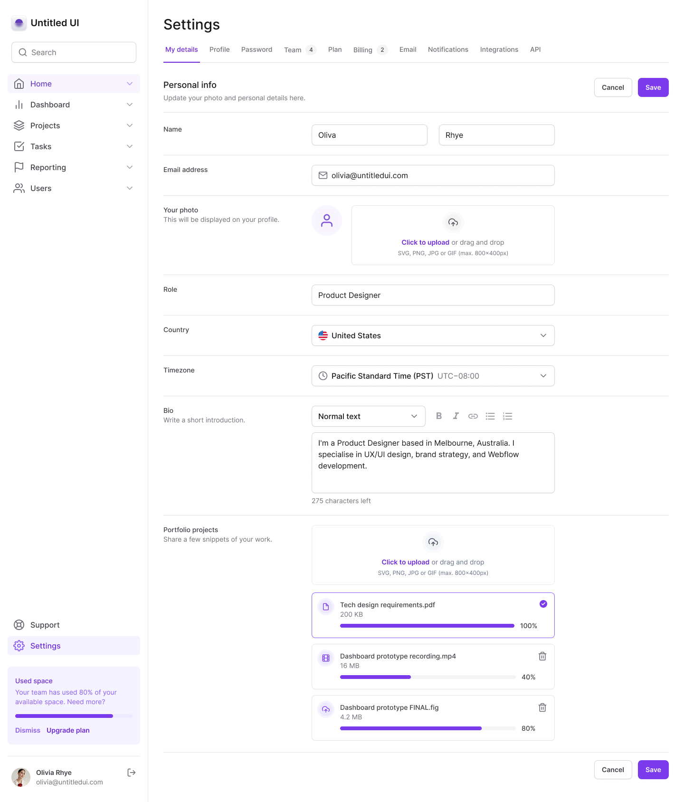

# 🎨 Dashboard UI – Tailwind + Next.js

A modern, responsive dashboard interface built with **Tailwind CSS** and **Next.js 15**, designed to master utility-first styling and component architecture. This project focuses on the practical application of Tailwind to build real-world layouts with theme switching, animations, accessibility, and responsive design patterns.

## 🖼️ Preview



---

## 🚀 Features

- 🎨 **Utility-first styling** with Tailwind CSS
- 🌙 **Theme switcher** using `next-themes`
- 📐 **Grid-based layout** with a fixed sidebar and dynamic content area
- 💡 **Radix UI** components (Collapsible, Tabs, Scroll Area, Select)
- 🎥 **Smooth animations** powered by Framer Motion and FormKit Auto Animate
- ⚛️ **Next.js App Router (v15)**
- 🧠 **Strong typing** across the app with TypeScript
- 🧰 **Tailwind Merge & Variants** for reusable styling patterns
- ✅ **Fully responsive layout**

---

## 🧰 Tech Stack

- **Next.js 15 (App Router)**
- **React 19**
- **TypeScript**
- **Tailwind CSS**
- **Radix UI**
- **Framer Motion**
- **@formkit/auto-animate**
- **next-themes**
- **lucide-react**
- **tailwind-merge**
- **tailwind-variants**
- **PNPM**
- **ESLint + Prettier**

---

## 📂 Project Structure

```text
src/
├── app/               # App Router structure (layouts, pages, etc.)
├── components/        # UI components (shared & domain-specific)
└── utils/             # Utility functions and helpers
```

## 👨‍💻 Developer Notes

This project demonstrates the power of **Tailwind CSS** to build modern, responsive, and accessible UIs. It emphasizes a utility-first approach that maximizes development speed and maintainability without sacrificing flexibility.

- Centralized layout system using CSS Grid and Tailwind utilities  
- Custom components built with **Radix UI** primitives for accessibility  
- **Dark mode** support via `next-themes` and Tailwind config  
- **Framer Motion** and **FormKit Auto Animate** for smooth UX transitions  
- Reusable style patterns powered by **tailwind-merge** and **tailwind-variants**  
- Designed with scalability and modularity in mind  